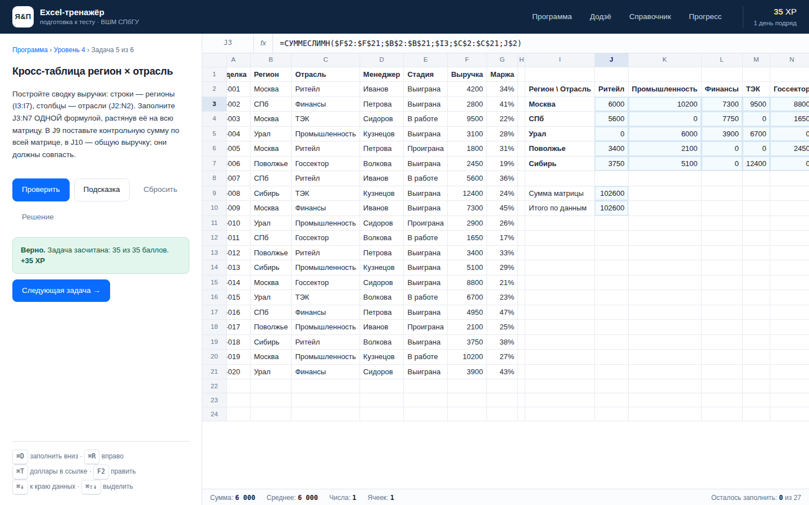

# Excel-тренажёр · подготовка к тесту «Яков и Партнёры»

Настольное приложение для macOS, которое доводит навык работы в Excel с нуля
до уровня, с которым не стыдно выйти на проект: от адреса ячейки до
декомпозиции роста выручки и мостика EBITDA.

Задачи решаются **в настоящей таблице внутри приложения** — со своим движком
формул, пересчётом, протягиванием и горячими клавишами. Проверяется не выбор
варианта из четырёх, а посчитанное значение в ячейке.



---

## Быстрый старт

```bash
git clone <адрес репозитория>
cd excel_test_YnP
./build_app.sh          # соберёт ExcelTrainer.app рядом со скриптом
open ExcelTrainer.app   # или двойной щелчок в Finder
```

Приложение можно перетащить в `/Applications` — оно самодостаточно, ставить
ничего не нужно.

Если бандл собирать не хочется:

```bash
./run.sh                # поднимет локальный сервер и откроет тренажёр
```

Совсем запасной вариант: открыть `app/index.html` в Google Chrome.
В Safari так прогресс сохраняться не будет — Safari запрещает хранилище для
локальных файлов.

### Что делает `build_app.sh`

| Шаг | Если инструмент есть | Если нет |
|---|---|---|
| `swiftc` (Xcode CLT) | собирает родное окно на WKWebView — приложение открывается без браузера | приложение откроется отдельным окном Chrome/Edge/Brave без вкладок и адресной строки |
| `python3` | поднимает локальный сервер на 127.0.0.1 — прогресс сохраняется всегда | страница открывается как файл; в Chrome прогресс сохранится, в Safari — нет |
| `sips` + `iconutil` | собирает иконку `.icns` | иконка кладётся как PNG |

Чтобы получить лучший вариант (родное окно + гарантированное сохранение):

```bash
xcode-select --install
```

Приложение собирается у вас на машине, поэтому Gatekeeper его не блокирует:
карантинного атрибута на локально созданных файлах нет.

---

## Что внутри программы

Десять уровней, 61 задача, 1685 баллов. Следующий уровень открывается, когда
на предыдущем набрано 60% баллов.

| № | Уровень | О чём |
|---|---|---|
| 1 | Ссылки и арифметика | адреса, операции, `$A$1` против `A1`, смешанные ссылки |
| 2 | Округление, рост, средние | `ОКРУГЛ`, прирост, CAGR, средневзвешенная цена, медиана против среднего |
| 3 | Логика | `ЕСЛИ`, вложенность, `И`/`ИЛИ`, `ЕСЛИОШИБКА`, ступенчатые шкалы |
| 4 | Условные агрегаты | `СУММЕСЛИМН`, `СЧЁТЕСЛИМН`, кросс-таблица одной формулой, шаблоны `*ов` |
| 5 | Поиск данных | `ВПР` точный и приблизительный, `ИНДЕКС`+`ПОИСКПОЗ`, двумерный поиск, `ПРОСМОТРX` |
| 6 | Текст и даты | чистка выгрузок, разбор ФИО, составной ключ, кварталы, `КОНМЕСЯЦА`, `РАЗНДАТ` |
| 7 | Финансовые расчёты | дисконтирование, `ЧПС`, `ВСД`, `ПЛТ`, юнит-экономика, безубыточность |
| 8 | Анализ данных | `СУММПРОИЗВ` с условиями, таблицы чувствительности, когорты, концентрация |
| 9 | Консалтинговые кейсы | сайзинг рынка сверху и снизу, PVM-декомпозиция, мостик EBITDA, загрузка команды |
| 10 | Экзамен | 10 смешанных задач, 45 минут, без подсказок, проходной балл 70% |

Помимо уровней:

* **Додзё горячих клавиш** — блиц по 37 сочетаниям Excel для macOS, по функциям
  и по кодам ошибок. Отвечать можно цифрами `1`–`4`, не притрагиваясь к мыши.
* **Справочник** — сочетания клавиш (macOS и Windows рядом), функции с типовым
  применением, разбор ошибок `#Н/Д`, `#ЗНАЧ!`, `#ССЫЛКА!` и остальных.
* **Прогресс** — XP, серия дней, точность в додзё, история экзаменов и очередь
  на повторение: туда попадает всё, что решено с подсказкой, не полностью или
  с подсмотренным решением.

---

## Как устроена проверка

Правильный ответ **не записан в задаче константой**. У каждой задачи есть
эталонная формула; при проверке приложение считает по ней ответ на том же
листе и сравнивает с вашим значением. Разойтись условие и ответ не могут —
это гарантируется тестами.

Кроме значения проверяется способ решения:

* ответ должен быть **формулой**, а не вбитым числом;
* формула должна ссылаться на ячейки, а не содержать зашитые константы;
* где нужно — требуется конкретная функция (в задаче на поиск влево `ВПР`
  прямо запрещён, нужны `ИНДЕКС`+`ПОИСКПОЗ`);
* где нужно — требуются доллары в правильных местах (`$B$8`, `$I3`, `J$2`),
  иначе формула не переживёт протягивания.

Подсказка стоит 30% баллов задачи, просмотр решения оставляет не больше 40%.

---

## Горячие клавиши в тренажёре

Работают ровно так же, как в Excel для macOS.

| Сочетание | Действие |
|---|---|
| `⌘D` / `⌘R` | заполнить вниз / вправо с переносом относительных ссылок |
| `⌘T` или `F4` | переключить `A1` → `$A$1` → `A$1` → `$A1` прямо при вводе |
| `⌘↓` `⌘→` | перейти к краю блока данных |
| `⌘⇧↓` | выделить до края данных |
| `F2` | редактировать ячейку |
| `⌘C` / `⌘V` / `⌘X` / `⌘Z` | копировать, вставить (со сдвигом ссылок), вырезать, отменить |
| `Delete` | очистить выделение |
| `Tab` / `Enter` | вправо / вниз |

Во время ввода формулы клик по ячейке подставляет её адрес — как в Excel.
Внизу листа, как в Excel, показываются сумма, среднее и количество по
выделению.

> Если браузер перехватывает `⌘T` (открывает новую вкладку), используйте `F4`.
> В родном окне, собранном через `swiftc`, `⌘T` свободен и работает штатно.

---

## Формулы: русские и английские

Движок понимает оба языка и оба разделителя аргументов:

```
=СУММЕСЛИМН($F$2:$F$21;$B$2:$B$21;$I3;$C$2:$C$21;J$2)
=SUMIFS($F$2:$F$21, $B$2:$B$21, $I3, $C$2:$C$21, J$2)
```

Десятичная запятая работает так же, как в русском Excel: `ОКРУГЛ(2,5;0)`
даёт `3`, а `SUM(1,2)` в английской записи — это два аргумента.

Реализовано около 130 функций: математика и статистика, логика, условные
агрегаты, поиск (включая `ПРОСМОТРX`, `СМЕЩ`, `ДВССЫЛ`), текст, даты,
финансы (`ЧПС`, `ВСД`, `ЧИСТНЗ`, `ЧИСТВНДОХ`, `ПЛТ`, `ПС`, `БС`, `КПЕР`,
`СТАВКА`), информационные. Поддержаны массивные вычисления вида
`СУММПРОИЗВ((B2:B21="Москва")*F2:F21)` и ошибки Excel с их распространением
по цепочке формул.

---

## Разработка

```bash
npm install        # нужен только для браузерных тестов (playwright)
npm test           # все проверки
```

| Набор | Что проверяет |
|---|---|
| `tests/formula.test.js` | 98 проверок движка формул — значения сверены с поведением Excel |
| `tests/curriculum.test.js` | 2323 проверки программы: эталон каждой задачи решает её сам, не выдаёт ошибок Excel, а пустой лист задачу не проходит |
| `tests/ui.test.js` | 42 проверки интерфейса в настоящем Chromium: ввод формул, `⌘D`, `⌘T`, кросс-таблица, экзамен с таймером, сохранение прогресса |

### Структура

```
app/                 само приложение (открывается и как обычная страница)
  js/formula.js      токенайзер, парсер и интерпретатор формул
  js/engine.js       модель листа: ячейки, пересчёт, форматы
  js/grader.js       проверка решений по эталону
  js/curriculum.js   10 уровней и 61 задача
  js/drills.js       додзё: клавиши, функции, ошибки
  js/grid.js         интерактивная таблица с клавиатурой Excel
  js/app.js          экраны и навигация
  js/storage.js      прогресс
packaging/           сервер, launcher, родное окно на Swift, иконка
build_app.sh         сборка ExcelTrainer.app
run.sh               запуск без сборки
tests/               проверки
```

### Как добавить задачу

В `app/js/curriculum.js` в нужный уровень добавьте объект:

```js
{
  id: '4.7', title: 'Название', points: 25,
  brief: 'Что нужно сделать',
  hint: 'Подсказка',
  sheet: { cells: { A1: 'Заголовок', A2: 100 }, styles: { 'A1:B1': H } },
  target: ['C2:C6'],                       // что заполняет ученик
  solution: { 'C2:C6': '=A2*B2' },         // эталон: он же источник правильного ответа
  check: { '*': { mustUse: ['СУММЕСЛИМН'] } }
}
```

Формула эталона для диапазона пишется для его первой ячейки и растягивается
на остальные с переносом ссылок — ровно как `⌘D` у ученика. После добавления
запустите `npm run test:curriculum`: он проверит, что задача решаема,
что эталон не даёт ошибок и что проверка действительно что-то проверяет.

---

## Прогресс и данные

Прогресс хранится в браузерном хранилище приложения и никуда не отправляется.
На странице «Прогресс» его можно выгрузить в файл и загрузить обратно —
например, чтобы перенести на другой компьютер.
